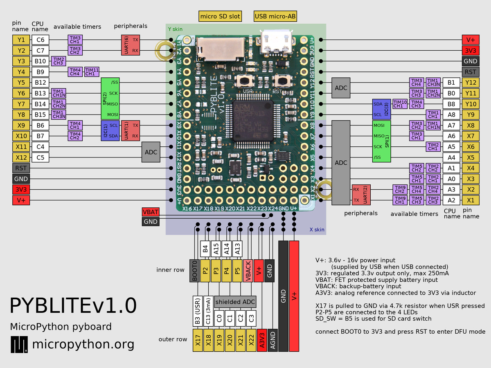

# SCD4x-Evaluation-Kit
SCD4x Evaluation Kit - CO2 sensor

# Board and sensor

I am using the Pyboard Lite v1.0 using Micropython. The sensor used is SCD41.

# Board pinout diagram

The sensor is connected to I2C1.

* SCL is X9
* SDA is X10

